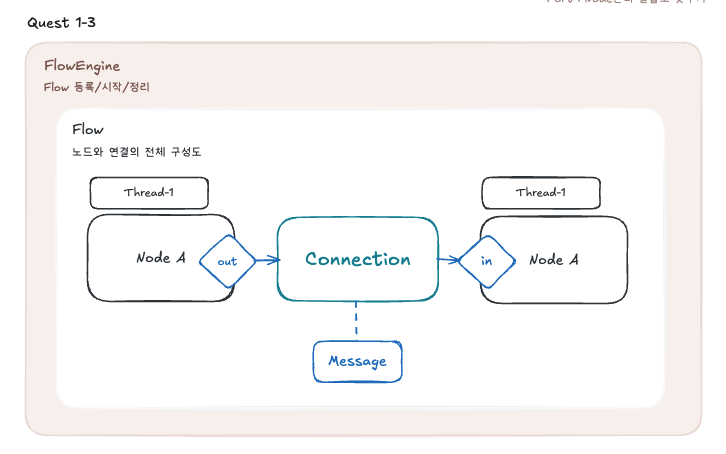
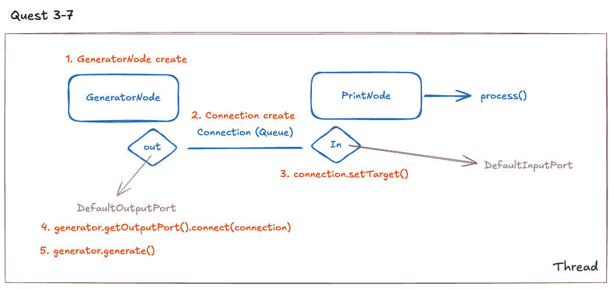
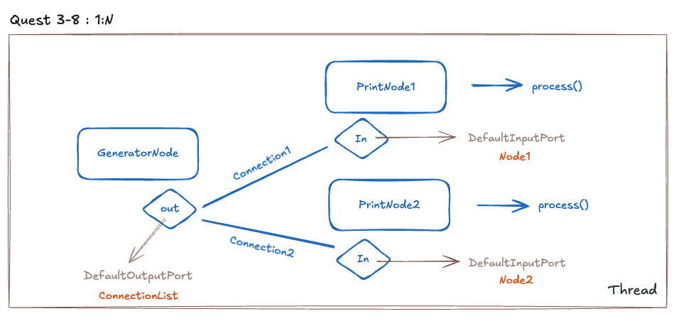
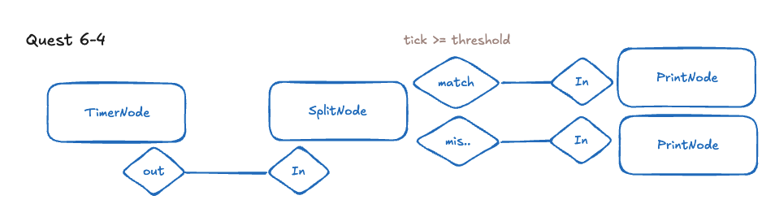
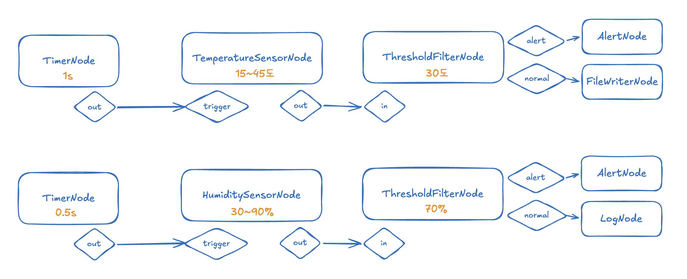
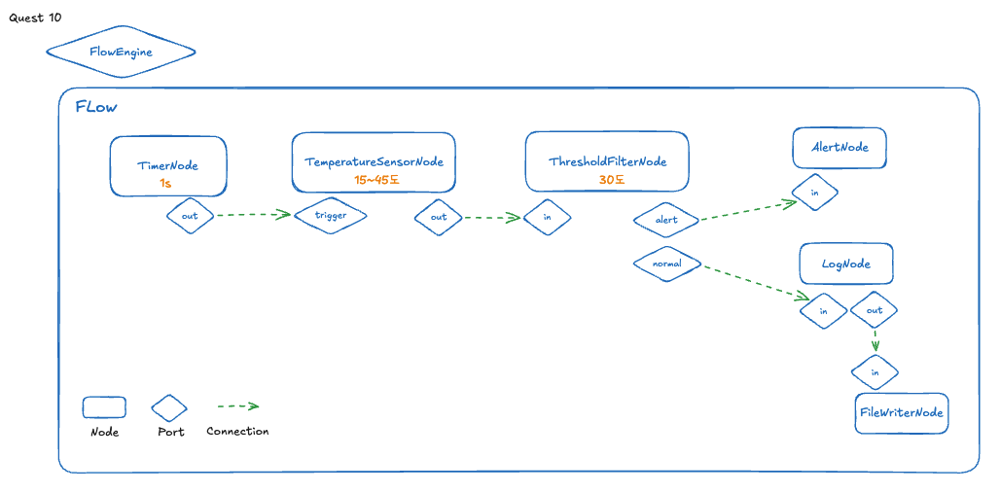
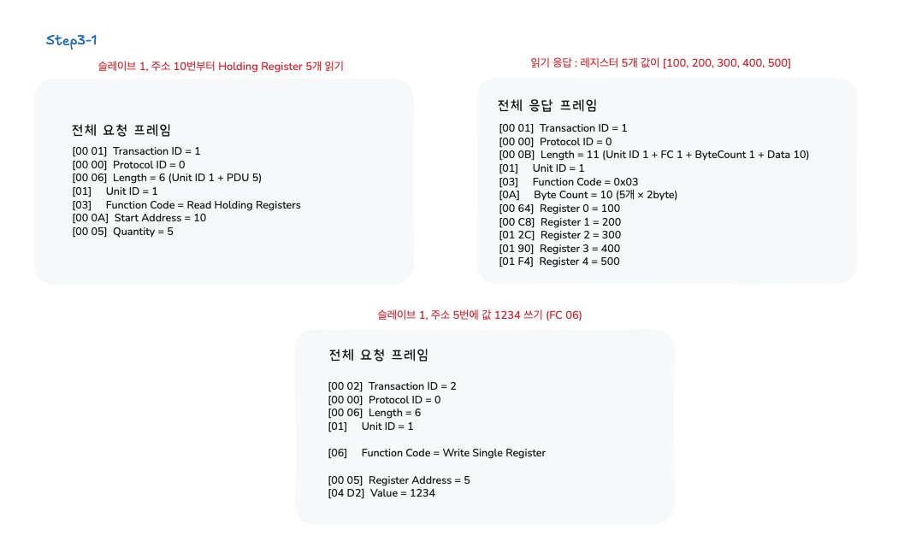

# IoT Rule Engine
# Step1

## 환경 구축 & FBP 개념

> Maven 프로젝트 생성, 패키지 구조, FBP 5요소 이해

### FBP

- 독립적인 처리 단위(노드)들 사이로 데이터(메시지)가 흘러가는 방식
- 핵심 요소

| 요소 | 역할 | 비유 |
| --- | --- | --- |
| Node | 데이터를 처리하는 독립 단위 | 작업대 |
| Port | 노드의 입구(In)와 출구(Out) | 작업대의 입출력 선반 |
| Connection | 포트 사이를 연결하는 통로 | 컨베이어 벨트 |
| Message | 노드 사이를 이동하는 데이터 | 벨트 위의 부품 |
| Flow | 노드와 연결의 전체 구성도 | 공장 배치도 |

### 과제

1. FBP 엔진에 필요한 핵심 클래스 목록



| 소속 패키지 | 클래스/인터페이스 | 역할 |
| --- | --- | --- |
| core | `Node` | 모든 노드가 구현할 인터페이스 |
|  | `InputPort` | 메시지를 받는 입구 인터페이스 |
|  | `OutputPort` | 메시지를 보내는 출구 인터페이스 |
|  | `Connection` | 포트 사이를 연결하는 통로 |
|  | `Flow` | 노드와 연결의 전체 구성도 |
|  | `FlowEngine` | 여러 Flow를 등록/시작/정지하는 관리자 |
| message | `Message` | 노드 사이를 이동하는 데이터 |
| node | `Node 구현체` | Node 인터페이스를 구현한 구체적인 노드들 |
| runner | `Main` | 엔진 실행 진입점 |
2. FBP 엔진 아키텍처 다이어그램

   Q1. 노드와 노드 사이 데이터는 어떤 경로로 전달?

    - **Connection**

   Q2. 노드가 동시에 동작하려면 무엇이 필요한가?

    - 각 노드마다 별도의 **Thread**가 필요
    - 노드들이 공유 자원(Connection)에 동시 접근할 때 **synchronized** or **BlockingQueue**로 처리

   Q3. 플로우를 "실행"한다는 것은 구체적으로 무엇을 의미하는가?

    - FlowEngine이 Flow 안의 노드들을 꺼내서, 각 노드마다 Thread를 하나씩 생성하고 실행
    - 즉, **노드 수만큼 스레드를 켜는 것**

## Step2
## Node / Message 설계

> 인터페이스·제네릭, Message(불변), PrintNode

### Message
- 불변 객체
    - 한번 만들어지면 내부 상태가 절대 바뀌지 않는 객체
    - 설계 이유 : 나중에 여러 스레드가 동시에 같은 메시지를 읽어도 안전
    - 핵심 구현 방법
        1. 생성자에서 외부 Map 복사 : Collections.unmodifiableMap(new HashMap<>(payload));
        2. 데이터 추가 시 새 객체 반환
- 가변 객체
    - 문제 : 누가 언제 바꿨는지 추적 불가

### Node, Message 에서 ID를 갖는 이유

- Node : 연결 정의, 실행 관리, 디버깅 & 로그
- Message
    - 메시지 추적, 중복 처리 / 재처리 방지
    - UUID : 전역 유일성, 분산 시스템 대비

### Timestamp

- 데이터 생성 추적 가능
- 시간 기반 처리 가능

## Step3

## Port & Connection 설계

> InputPort, OutputPort, Connection(Queue), FilterNode

### Node는 처리만 하고 전달은 Port + Connection이 한다

### Port

- Node 간의 결합도 낮추기
- **InputPort** : `Connection → InputPort → Node.process()`
- **OutputPort** : `Node → OutputPort → Connection 들`

### 과제

1. Connection
    - buffer를 사용하는 이유
        - 생산자(Output)와 소비자(Input)를 분리하기 위해서
        - 둘의 속도가 다를 수 있기 때문에

[구조]





## Step4

## 스레드 기초 & 동시성

> Thread, BlockingQueue, Connection 개선, 멀티스레드 파이프라인
>
- 각 노드가 자기 속도로 처리하고, 서로 기다리지 않도록 함

### Producer / Consumer

- Producer : 메시지 생성
- Consumer : 메시지 처리

### BlockingQueue

- 데이터가 없으면 자동으로 기다리는 큐
- **busy waiting**
    - poll() : 데이터가 없으면 null, 계속 확인해야 함
    - 해결 : take() - 데이터 없으면 자동 대기, 들어오면 바로 깨어남

### 과제

1. ArrayList vs synchronized vs BlockingQueue

| 방식 | 코드 길이 | 예외 처리 | CPU 사용률 |
| --- | --- | --- | --- |
| ArrayList (busy waiting) | 짧음 | 없음 | ❌ 높음 (계속 검사) |
| synchronized + wait/notify | 김 | 복잡 | ⭕ 낮음 |
| BlockingQueue | 매우 짧음 | 단순 | ⭕ 낮음 |

## Step5

## AbstractNode & 설계 패턴

> 추상 클래스, 생명주기, Template Method, TimerNode
- 노드 구현의 중복을 제거하고, 구조를 표준화

### 생명주기
- initialize → (process 반복) → shutdown

### Template Method

- 전체 흐름은 고정, 핵심만 바꾼다
- process()가 공통 흐름을 정의하고, 핵심 로직은 하위 클래스에 위임


## Step6

## 노드 라이브러리 확장

> TransformNode, SplitNode, CounterNode, DelayNode

### TransformNode

- 데이터 변환을 수행하는 범용 노드
- `Function<Message, Message>`
    - 변환 로직을 외부에서 주입
    - 변환마다 클래스를 새로 만들지 않기 위해서



## Step7
## Flow 클래스 & 그래프 구조
> Flow, 메서드 체이닝, validate, 순환 참조 탐지(DFS)

### Flow
- 노드 + 연결을 하나의 그래프로 관리하는 객체
- 구조 관리(노드, 연결)
- 생명주기 관리

## Step8
## FlowEngine 구현
> ExecutorService, 상태 관리, 다중 플로우, CLI

### FlowEngine
- Flow를 실행하고 관리하는 최상위 객체
- 여러 Flow의 실행을 통합/관리
- 역할
    - Flow 등록
    - Flow 시작 ( validate → initialize → 상태 변경)
    - Flow 정지
    - 전체 종료 : shutdown

### ExecutorService
- Thread Pool 사용

- Thread
    - 능동적 노드(데이터를 생성하는)
        - initialize()에서 생성
        - shutdown()에서 정리
        - ex. TimerNode
    - 수동적 노드
        - 스레드 없음
        - 메시지를 받으면 처리만 함
        - Connection 스레드가 receive() 호출 → process() 실행
    - Connection의 스레드
        - FlowEngine이 각 Connection마다 스레드 생성
        - 수동적 전달 (메시지를 옮기는 역할)만 담당
      
## Step9
## IoT 시나리오 적용
> SensorNode, ThresholdFilter, AlertNode, FileWriter
### 온도 / 습도 모니터링 플로우


## Step10
## 통합 테스트 & 리팩토링
> JUnit 5, CollectorNode, 약 125개 테스트, 리팩토링
### Collector

- 테스트에서 노드 출력을 검증하기 위한 노드
- PrintNode 대신 파이프라인 끝에 연결하여 콘솔 출력 없이 메시지 수신 결과를 검증 가능

### 최종 종합


# Stage 2

## Step2
## MQTT
> 센서가 데이터를 발행(Publish)하면 관심 있는 시스템이 해당 주제를 구독(Subscribe)하여 수신하는 구조
- Broker : 메시지 중개자. 발행자와 구독자를 연결
- Topic : 메시지 주소, 계층 구조
  - sensor/+ : 와일드카드, sensor/ 아래 모든 하위 토픽
  - sensor/# : 다중 레벨 와일드카드, sensor/ 아래 모든 레벨
- QoS : 메시지 전달 보장 수준 (0,1,2)
- Retained Message : Broker가 토픽의 마지막 메시지 저장
- Last Will and Testament (LWT) : 클라이언트 비정상 종료 시 Broker가 미리 등록된 유언 메시지를 발행

## Step3
## MODBUS
> 마스터(엔진)가 슬레이브(장비)에게 요청을 보내면 슬레이브가 응답

### MODBUS TCP 프레임 구조
- MBAP Header (7byte)
    - MODBUS TCP 고유의 헤더
    - 모든 요청과 응답에 포함

        ``` 
        바이트 위치:  [0][1]     [2][3]    [4][5]          [6]
                   ──────     ──────    ──────          ───
        의미:       트랜잭션 ID  프로토콜 ID  길이(이후 바이트수) 유닛 ID
                   (2byte)    (2byte)   (2byte)         (1byte)
        ```

      | **필드** | **크기** | **설명**                             |
              | --- | --- |------------------------------------|
      | Transaction ID | 2 바이트 | 요청/응답 쌍을 식별. 요청에서 보낸 값이 응답에 그대로 돌아옴 |
      | Protocol ID | 2 바이트 | 항상`0x0000`(MODBUS 프로토콜)            |
      | Length | 2 바이트 | 이 필드 이후의 바이트 수 (Unit ID + PDU 길이)  |
      | Unit ID | 1 바이트 | 슬레이브 ID. TCP에서는 보통 `0x01`또는`0xFF`  |

- PDU (5 byte)

  

## Step 4
## Rule
### RuleNode
> 조건식을 평가하여 메시지의 경로를 결정하는 노드
- 규칙 표현 방식
  - A. Java Predicate 기반 (코드 내 정의)
  - B. 문자열 기반 조건식 : 조건식 파서 구현 필요
  - C. 복합 규칙 (AND/OR) : 다중 조건 조합 가능

- ? FilterNode와 내부 동작이 비슷한데 이름이 RuleNode인 이유
  - RuleNode는 단순 필터를 넘어서 "비즈니스 규칙"을 표현 

### Rule Engine
> 규칙들을 실행하는 시스템 전체, 숨낳은 RuleNode들의 집합

# Stage 3
> 사용자가 JSON/YAML 설정만으로 플로우를 자유롭게 구성하고
커스텀 노드를 플러그인 형태로 추가할 수 있는 확장형 FBP 엔진을 설계/구현

## Step 1~3 기본 엔진 구현 + 확장 아키텍처 설계

### NodeRegistry
> 노드 생성 중앙 관리소 역할

- 문자열 타입명과 실제 노드 생성 로직을 연결해주는 역할
- `typeName → NodeFactory → Node 생성`
- **NodeFactory**
    - config를 받아 실제 Node 생성
    - 노드 생성 함수형 인터페이스
        - 람다 등록이 가능함
    - Factory ?
        - 노드마다 생성 규칙이 다름
        - 공통 생성 인터페이스가 필요

### Flow 정의 구조
- 엔진은 외부 JSON/YAML 정의를 읽어서 플로우를 구성(노드 생성, 포트 연결, 플로우 실행)해야 한다
- 플로우 정의 예시 (JSON)

    ```json
    {
      "id": "temperature-monitoring",
      "name": "온도 모니터링 플로우",
      "description": "MQTT 센서 데이터를 수신하여 임계값 초과 시 알림",
      "nodes": [
        {
          "id": "sensor",
          "type": "MqttSubscriber",
          "config": {
            "broker": "tcp://localhost:1883",
            "topic": "sensor/temp",
            "qos": 1
          }
        },
        {
          "id": "rule",
          "type": "ThresholdFilter",
          "config": {
            "field": "value",
            "operator": ">",
            "threshold": 30
          }
        },
        {
          "id": "alert",
          "type": "MqttPublisher",
          "config": {
            "broker": "tcp://localhost:1883",
            "topic": "alert/temp"
          }
        }
      ],
      "connections": [
        { "from": "sensor:out", "to": "rule:in" },
        { "from": "rule:out", "to": "alert:in" }
      ]
    }
    ```


### Plugin 구조
- 외부 JAR만 추가하면 새 노드 타입 자동 등록
- 엔진 수정 없이 기능 추가
- 흐름
    - 외부 jar 추가
    - Pluginmanager 스캔
    - ServiceLoader 실행
    - NodeProvider 발견
    - NodeRegistry 자동 등록
